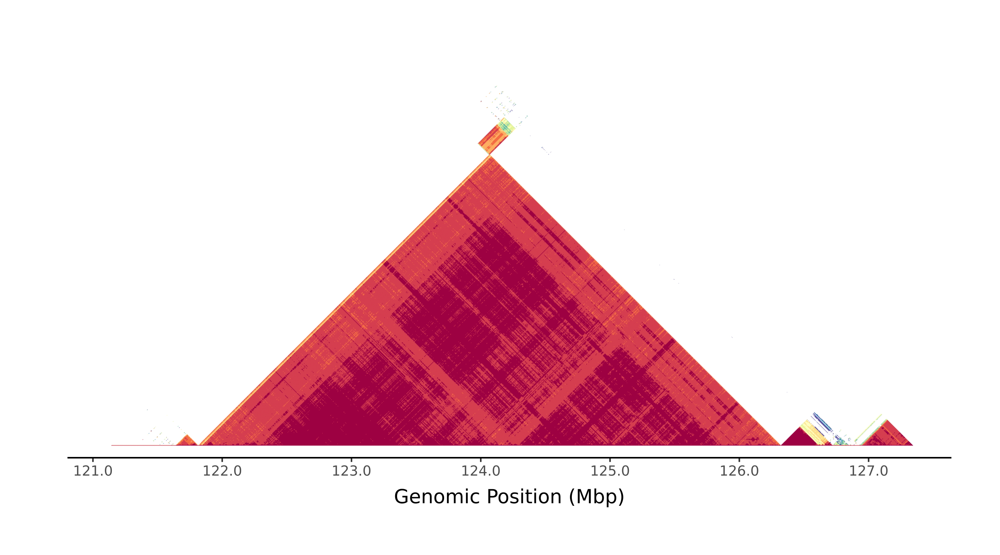
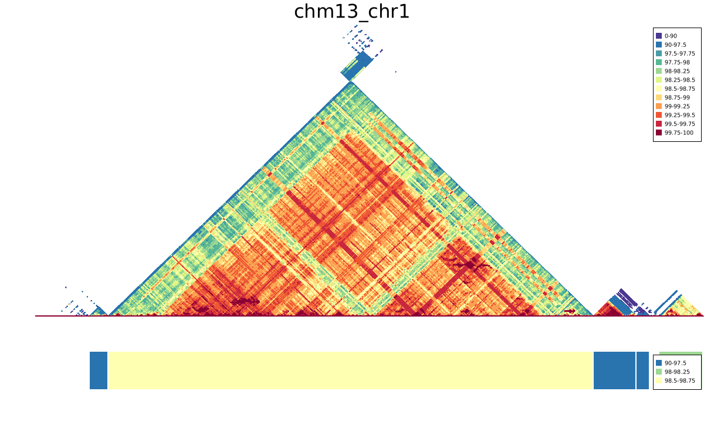

# rs-ModDotPlot
[](https://github.com/logsdon-lab/rs-moddotplot/actions/workflows/ci.yaml)

Rust API implementation of the [`ModDotPlot`](https://github.com/marbl/ModDotPlot) ANI algorithm.

## Usage
```bash
cargo add --git https://github.com/koisland/rs-moddotplot.git
```

```rust
// Compute the self-sequence identity of the CHM13 chr1 centromere.
// Write bedfile to stdout.
use std::io::{stdout, BufWriter, Write};
use rs_moddotplot::{compute_self_identity, Row};

fn main() {
    let bed = compute_self_identity("data/chm13_chr1.fa", None);
    let mut fh = BufWriter::new(stdout());
    writeln!(&mut fh, "{}", Row::header()).unwrap();
    for row in bed {
        writeln!(&mut fh, "{}", row.tsv()).unwrap();
    }
}
```

## Example
Self-identity
```bash
cargo run --example ident --release -- data/chm13_chr1.fa
```

Local self-identity
```bash
cargo run --example local_ident --release -- data/chm13_chr1.fa
```

Grouped self-identity
```bash
cargo run --example group_ident --release -- data/chm13_chr1.fa
```

Plot self-identity
```bash
cargo run --example plot_self_ident --release -- data/chm13_chr1.fa chm13_chr1.png
```

Comparison to ModDotPlot v0.9.9. See (examples/run_moddotplot_cmp.sh).
|ModDotPlot|This version|
|-|-|
|||

* Difference in colorscale. This uses a custom set of breakpoints (examples/colorscale.tsv) to better highlight duplications. Custom colorscales currrently don't work in v0.9.9 (See https://github.com/marbl/ModDotPlot/issues/57)
* Murmurhash implementation difference (https://github.com/hajimes/mmh3 vs https://github.com/stusmall/murmur3) results in slight average self-identity differences. Unclear how the seed is set for python murmurhash implementation and ModDotPlot doesn't set [it](https://github.com/marbl/ModDotPlot/blob/a2268ee0a92f4bc2a06851ccb817bb170a7af7d9/src/moddotplot/parse_fasta.py#L64). This implementation sets the hasher seed but the general satellite region boundaries appear similar and BEDPE rows are not equal.

## Test
```bash
cargo test --release
```

## TODO:
* [ ] - More tests and docstrings.
* [ ] - Improve error handling and type casts.
